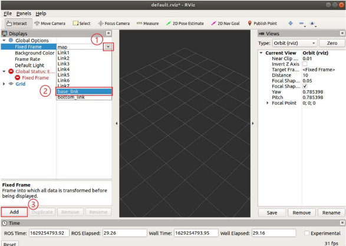
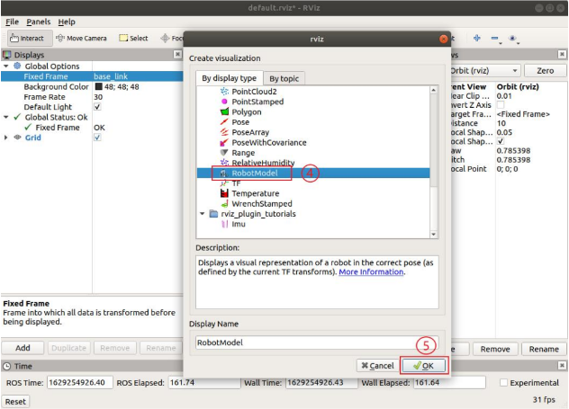
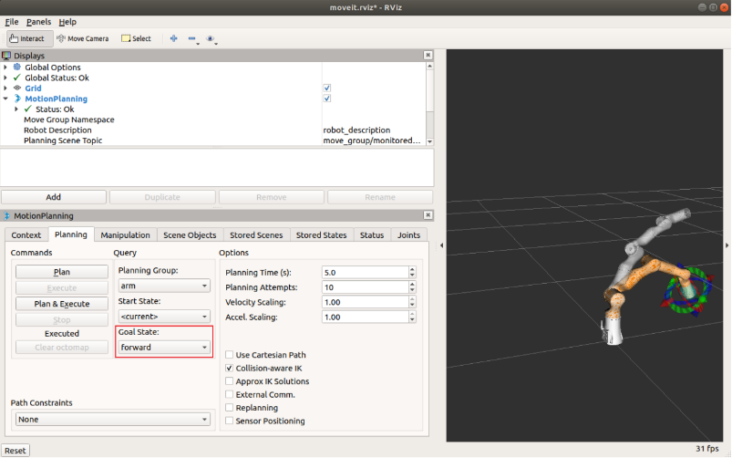
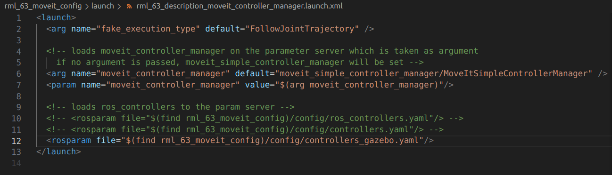
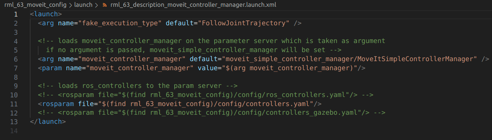

## About
This repository contains ROS packages for the WRL63-B robot arm

Operating System: Ubuntu 18.04, 20.04</br>
ROS Version: Melodic, Noetic

## Packages
rml_63_description
* Robot models and configuration files
* rm_63_bottom.urdf.xarco: RML63-B model without end tool

rml_63_moveit_config
* launch and configuration files to start MoveIt motion planning

rm_gazebo
* parameters and configuration files for Gazebo robot model

rml_63_demo
* MoveIt examples (obstacle avoidance, pick & play)

rm_msgs
* control and status messages

rm_control
* robot controller
* send cubic spline interpolated robot arm trajectories planned by MoveIt to rm_driver node every 20ms. Time period is adjustable but should be >10ms

rm_driver
* Establish socket connection with the robot arm through the ethernet port. Robot arm default IP address is 192.168.1.18
* subscribe to topics and update the joint angles of the robotic arm in RVIZ

rm_bringup
* automatically run rm_driver, rm_control, and RVIZ (MoveIt). Control real robot by dragging the simulated robot model

## Setup Workspace
1. Create workspace and change directory to the src folder
   ```
   $ mkdir -p <your_workspace>/src
   $ cd <your_workspace>/src
   ```
2. Git clone into the src folder
   ```
   git clone https://github.com/westonrobot/wrl63b_ros.git
   ```
3. Install system dependencies
   ```
   rosdep install -y --from-paths . --ignore-src --rosdistro <distro> -r
   ```
4. Build packages
   ```
   $ cd ..
   $ catkin init
   $ catkin build rm_msgs
   $ catkin build
   ```

## Visualize in RVIZ
Source robot workspace and launch rml_63_description package
```
roslaunch rml_63_description display_rml63_bottom.launch
```

If model is not shown, manually change the **Fixed Frame** to **base_link**, and add the robot model.



## Motion Planning using MoveIt
MoveIt is a motion planning library that integrates component packages related to mobile operations in the ROS system. Through the MoveIt plug-in, you can control the robot arm to complete 
functions such as drag planning, random target planning, initial position and pose update, and collision detection.

Run MoveIt demo of the RML63B robotic arm in simulation
```
roslaunch rml_63_moveit_config demo.launch
```

1. Drag Planning
   * Drag the front end of the robot arm to change its position and pose. Then click the "Plan & Execute" button on the Planning tab
2. Target Planning
   * Click the Goal State drop-down list in the Planning tab to select the target position and pose of the robot arm, and then click the "Plan & Execute" button
   

## MoveIt with Gazebo Simulation
1. Modify the **rml_63_moveit_controller_manager.launch.xml** in the **rml_63_moveit_config** package to load the **controllers_gazebo.yaml** file 


2. Start RVIZ (MoveIt) and Gazebo
   ```
   roslaunch rm_gazebo rml_63_bringup_moveit.launch
   ```
3. Set **Fixed Frame** to **base_link**. Then add **MotionPlanning** into the panel. In RVIZ, drag the arm to a new position, then click **Plan & Execute**. The arm in Gazebo will then move to the position set in RVIZ. 

## Examples (Simulation)
1. Obstacles Avoidance
2. Pick & Place

### Obstacles Avoidance
1. Launch robotic arm in RVIZ with MoveIt
   ```
   roslaunch rml_63_moveit_config demo.launch
   ```
2. Launch python file containing obstacles in another terminal
   ```
   rosrun rml_63_demo moveit_obstacles_demo.py
   ```

   **Note**: Run "sudo chmod +x <python_file>.py" if the python files are not executable

### Pick & Place
1. Launch robotic arm in RVIZ with MoveIt
   ```
   roslaunch rml_63_moveit_config demo.launch
   ```
2. Launch pick_place_demo cpp file in another terminal
   ```
   rosrun rml_63_demo pick_place_demo
   ```

## MoveIt with real robot
1. Before operating it, make sure the robot and PC are connected to the same WiFi. Ping the robot and make sure there is a connection.
   ```
   ping 192.168.1.18
   ```
2. Modify the **rml_63_moveit_controller_manager.launch.xml** in the **rml_63_moveit_config** package to load the **controllers.yaml** file


3. Launch rm_control package
   ```
   roslaunch rm_control rm_control.launch
   ```
3. Launch rm_driver package and MoveIt
   ```
   roslaunch rm_bringup rm_robot.launch
   ```
4. In RVIZ, drag the arm to a new position or select **Goal State**, then click **Plan & Execute**. The robotic arm will then move to the target location.